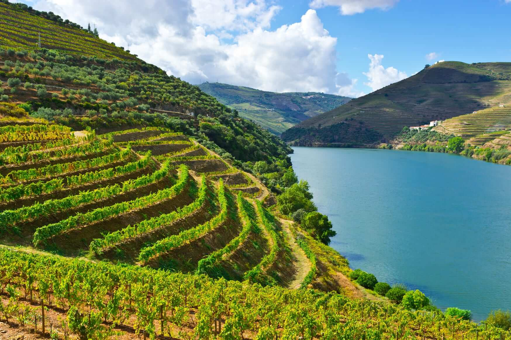
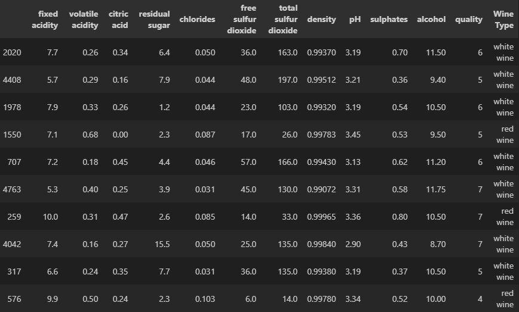
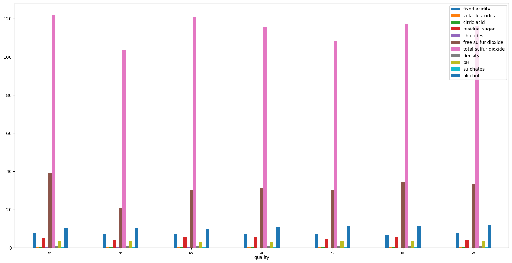
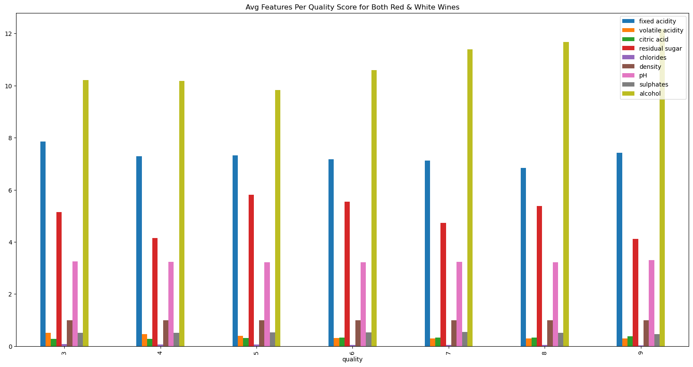
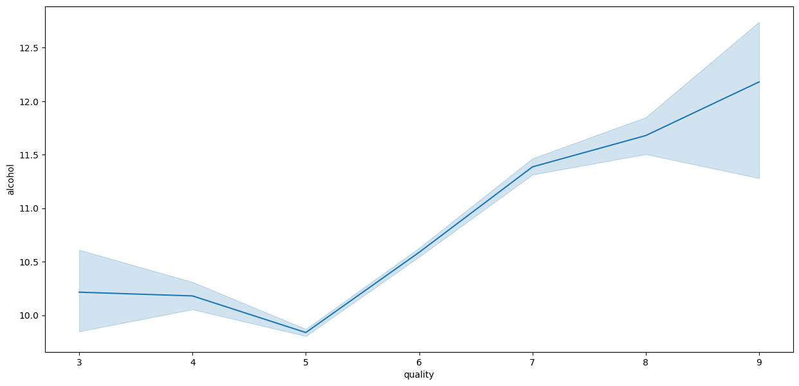
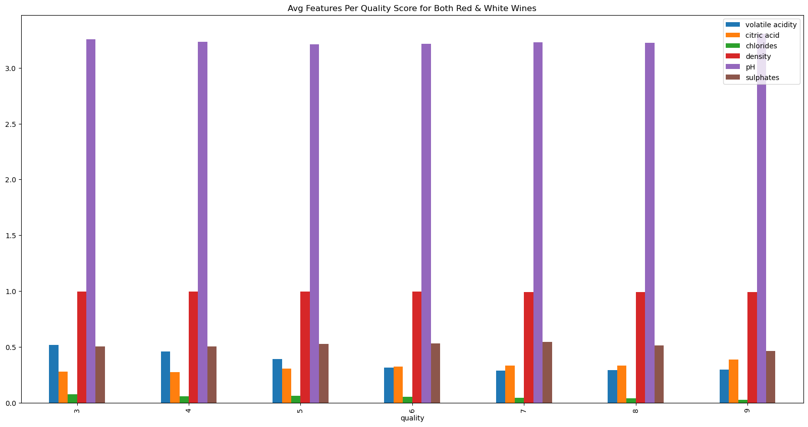
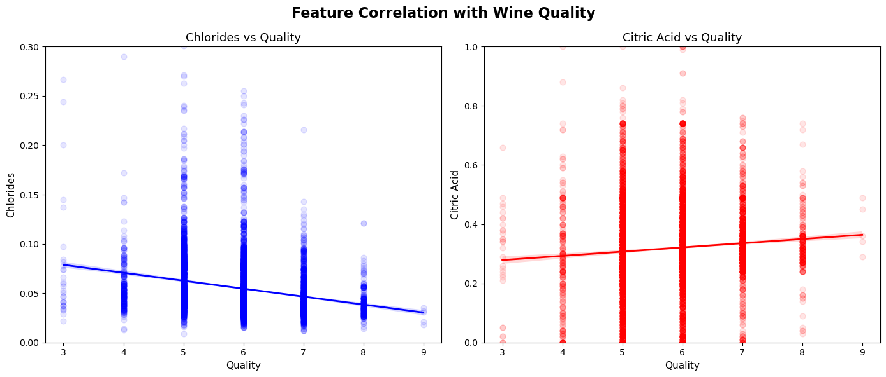
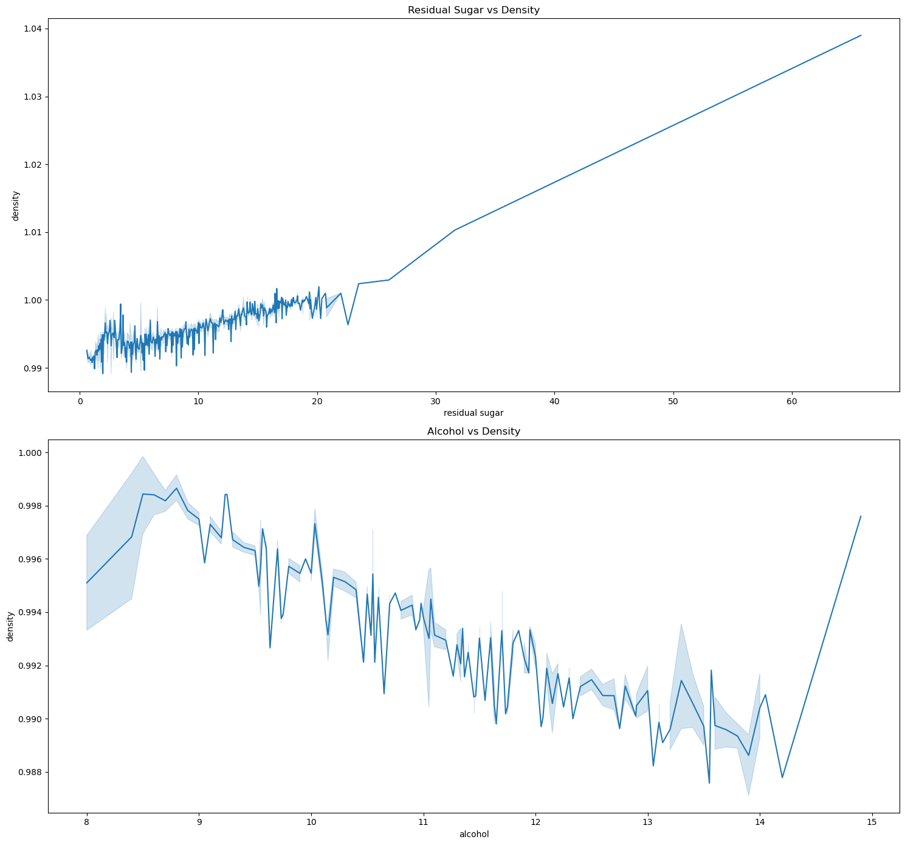
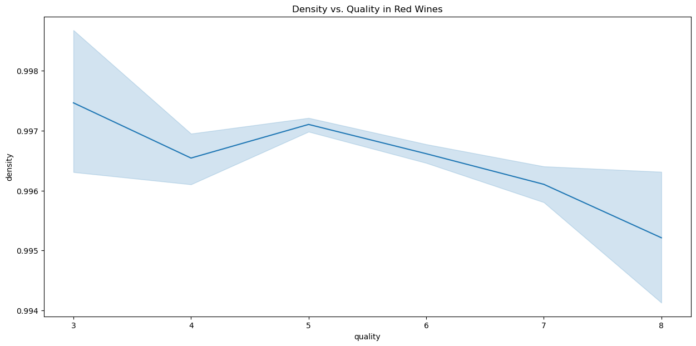
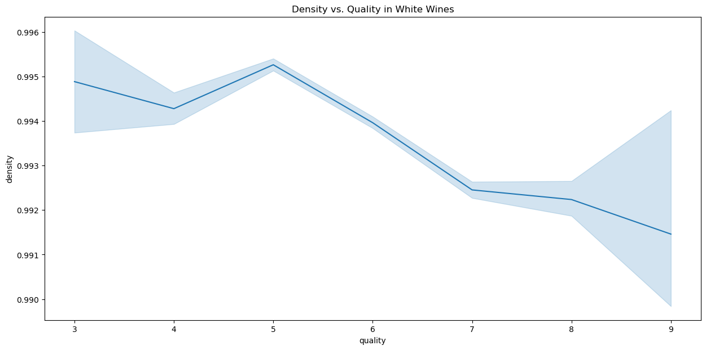

# DDI-Midterm-Project
# **Background**
---
The Vinho Verde Region of Northern Portugal is Portugal's largest wine region, located in the lush, northwest Minho province. Renown for its fresh, high-acid, often slightly sparkling white wines, this coastal, cool-climate, and high-rainfall region consists of nine sub-regions and produces white, red, and rose varieties of wine. It spans from the Atlantic Coastline in the West to the Freita, Arada, and Montemoru mountains to the East, down to the Douro River in the South and up to the Minho River in the North.

"Vinho Verde" refers to the region rather than "green" wine or young, unripe grapes. The name hints at the young, fresh, and lively nature of the wine. The producers and winemakers of the beautiful region are eager to share their increasingly sophisticated, complex wines with the world.

# **Data**
---
The Vinho Verde Wine Dataset includes two separate datasets, one composed of only white wines, and another composed with only red wines. These datasets feature the different chemical compositions and features of winemaking that are featured within each of the wines. The names of the wines are completely anonymized, and only categorized by their red or white category.

The dataset records approximately 1,600 red wines, and approximately 4,900 white wines. Being that the region is much more famous for their white wines, it is understandable why there are thousands more white wine samples within the dataset.

Each of the wines are scored on a quality scale of 3-8 for red wine, and 3-9 for white wine, based on the 11 distinct features found in wine/winemaking: fixed acidity, volatile acidity, citric acid, residual sugar, chlorides, free sulfur dioxide, total sulfur dioxide, density, pH, sulphates, and alcohol percentage. Pictured below is a sample of ten different wines taken from the dataset to provide a picture of what exactly this data looks like in raw form.

# **Table of Contents - Wine Terminology**
---

**Fixed Acidity**: Main acidic component in wine. Provides essential structure, freshness, and color stability. Crucial for preventing spoilage.

**Volatile Acidity**: Used to balance high sugar levels of grapes, providing a “clean” finish rather than a cloying (excessively sweet) finish.

**Citric Acid**: A weak, organic acid, present in small amounts in grapes, often used to increase total acidity, improve flavor brightness (fruitiness), and stabilize.

**Residual Sugar**: Natural grape sugar (glucose and fructose) remaining in wine after fermentation. Defines sweetness of wine, necessary to add body/texture.

**Chlorides**: Often present as salts, acting as a major contributor to a wine’s salinity, mouthfeel (softening the taste), and perceived acidity. Referred to as “minerality”.

**Free Sulfur Dioxide**: Portion of unbound (free to react with O2 & microbes), active sulfur dioxide that acts as a crucial preservative. Amount is dependent on pH.

**Total Sulfur Dioxide**: The sum of unbound and bound sulfur compounds. The bound sulfur dioxide is the portion that has already reacted with the elements.

**Density**: The value of density decreases during fermentation as sugar converts to alcohol. Higher alcohol content decreases density.

**pH**: The acidity in wine, ranging from 2.5 to 4.5. Essential for taste, color, stability, and bacterial protection. A lower pH equates to higher acidity and a crisper taste.

**Sulphates**: Act as a cleansing agent and minerals in the wine. Prevents wine from turning into vinegar and stabilize the wine, so they act as preservatives.

**Alcohol**: Primarily ethanol, a natural byproduct produced when yeast converts sugar from grape juice during fermentation. Provides body, texture, and a warming sensation.

**Quality**: Generally defined by a balance of components (fruity, acidity, tannins, alcohol), intensity of flavor, complexity, and a pleasant finish (BLIC: balance, length, intensity, complexity).

# **Exploratory Data Analysis**
---
    Finding the Mean for each Feature Based on Quality Rating
Because of the wildly varying numbers and ranges of numbers with each feature/chemical component, having this visual representation paints a picture of the quality ratings and what the features range from based on the quality score. As you can see, it’s a bit difficult to tell what the other features show because the total sulfur dioxide and free sulfur dioxide are such a large number.

---
    Finding the Mean for each Feature Based on Quality Rating, but MINUS Total Sulfur Dioxide and Free Sulfur Dioxide Categories
Therefore, I stripped the chart of those categories, and we get a better understanding. The first most obvious discovery was that a greater alcohol percentage meant a higher quality score.

---
    Alcohol's Effect/Impact on Quality Ratings
Here’s a better look at alcohol’s impact on the quality score. There is a sharp increase from 5-9. Also, I want to note that in the white wine dataset, the quality score went up to 9. However, in the red wine dataset for some reason, the quality score only went up to 8. That’s why you see that large confidence interval between 8 and 9.

---
    Finding the Mean for each Feature Based on Quality Rating - Homing in on Smaller Values
Now here we home in on the smaller values so we can get a more granular look. We see that volatile acidity and citric acid are inversely related. As one goes up, the other goes down, vice versa. Additionally, as chloride percentage decreases, quality increases. Remember back in the table of contents how we talked about chloride being salts and minerality of the wine. These act as a major contributor to how the wine tastes and the perceived acidity. Too intense of “minerality” can take away from the complexity and taste of the wine.

---
    Chloride and Citric Acid Relationship with Quality
Here is a closer look at that. I do want to note that I took off the top 20% of each of these values to get rid of the outliers and get a better view of the increase and decrease that’s occurring. Because these numbers are so small, it’s hard to really tell, but this approach to wine making is clearly important when desiring higher quality scores from consumers. Less chlorides leads to a cleaner, less harsh, and more palatable wine. While higher acidification, particularly in white wines, provides liveliness and freshness of the wine, pronouncing more fruity flavors.

---
    Density's Effect on Quality
Finally, I focused in on density and residual sugar. As residual sugar increases, density increases. And as density decreases, alcohol percentage increases. As we recall, alcohol percentage has a massive impact on the quality scores of the wine.

---
    Density's Effect on Quality - Red Wine Only Dataset
When density's effect on quality is broken down on the red only dataset and white only dataset, you can see similarities, but also some notable differences.

    Density's Effect on Quality - White Wine Only Dataset
The wider flare on the quality score of "9" on the white wine dataset means there are very few datapoints with that quality score, so the confidence interval (estimate) is much less certain.

---
# **Key Findings**
---
The most optimally rated wines feature low density, higher alcohol volume, and low minerality combined with increased acidity. However, it is important to consider that the optimal features can change based on the type of wine - red or white.

# **Key Considerations**
---
It's important to remember that these wine varieties come from a specific region in the world, North Portugal. There are 10,000+ varieties of grapes, thousands that haven't been touched within this dataset. Additionally, Soil in North Portugal is composed of ancient, rocky, and low-fertility schist and granite, producing concentrated, mineral-driven, and high-acid wines. While somewhere like Napa Valley, California has more diverse soils, ranging from volcanic and limestone to clay-loam and sand, prioritizing higher vigor and riper fruit. Portugal is the 10th largest wine producer in the world, behind powerhouses like Italy, France, Spain, and the U.S.

# **Future Areas of Research**
---
For future research, I think it would be highly beneficial to do a similar data analysis of a dataset of similar size from one of the most popular and largest producing regions of the world for wine and seeing how it compares to this one. Regions like Napa Valley, California; Castilla La-Mancha, Spain; Veneto, Italy; or Bordeaux, France.